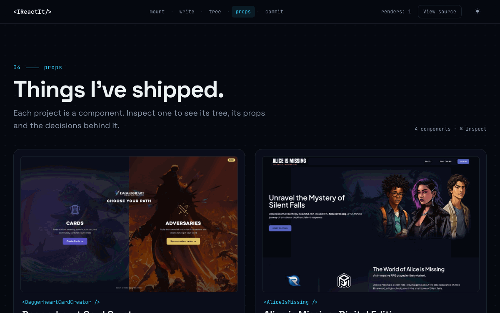

<p align="center">
  <a href="https://ireactit.com">
    <picture>
      <source media="(prefers-color-scheme: dark)" srcset="docs/readme/header-dark.svg">
      ">
    </picture>
  </a>
</p>

<p align="center">
  <a href="https://github.com/NothinButTreys/ireactit/actions/workflows/ci.yml"></a>
  <a href="https://github.com/NothinButTreys/ireactit/actions/workflows/deploy-check.yml"></a>
  <a href="https://ireactit.com"></a>
  <a href="vitest.config.ts"></a>
</p>

**[ireactit.com](https://ireactit.com)** is Trey McBride's portfolio, built as one pass through React's render cycle. The page **mounts** a hero, lets you **write** props into a live TypeScript component, grows a career **tree** node by node, passes each shipped project in as **props** you can open in a DevTools-style Inspector, and ends with a **commit** that sends a message from a terminal. It's React 19, Vite and strict TypeScript, prerendered at build time and hydrated in the browser. Every deployment is checked by four simulated visitors before anyone else sees it.

## The render cycle

| Step | What it shows |
| --- | --- |
| `#mount` | The hero types out its own tag, then mounts. A render log beside it ticks off each step as you scroll. |
| `#write` | `Trey.tsx` in an editor. Change a prop (mood, focus, coffee, stack) and the source, the live preview and the nav's `renders:` counter all update. |
| `#tree` | The career as a component tree. On large screens it pins and mounts node by node as you scroll; everywhere else it's a plain, fully rendered list. |
| `#props` | Four shipped projects, each a component. **Inspect** opens a DevTools-style panel with the component tree, its props, and the story behind each node. |
| `#commit` | A `git commit` terminal that sends a message through a serverless function, plus links to GitHub, LinkedIn and the résumé. |

Any section can flip to its own source: **View source** in the nav swaps each section for its syntax-highlighted code.

## Architecture

The page is a component tree, so the docs are one too. Expand a node to see what it does and where it lives.

<details open>
<summary><code>&lt;App/&gt;</code> — <a href="src/App.tsx"><code>src/App.tsx</code></a></summary>

<br>

Wraps the page in [`Providers`](src/Providers.tsx) (render counter, View Source, section progress), turns on Lenis smooth scrolling, and renders each of the five steps in a [`SectionView`](src/features/view-source/SectionView.tsx), so it can swap to its source without losing state.

<details>
<summary><code>├─ &lt;Nav/&gt;</code> — <a href="src/features/nav"><code>src/features/nav</code></a></summary>

<br>

The sticky rail of the five steps (a bottom pill bar on phones), with the active step tracked by `useActiveSection`. It also holds the `renders:` counter ([`render-counter`](src/features/render-counter)), the View Source toggle ([`view-source`](src/features/view-source)) and the theme toggle.

</details>

<details>
<summary><code>├─ &lt;Hero/&gt;</code> — <a href="src/features/hero"><code>src/features/hero</code></a></summary>

<br>

`#mount`. A typewriter hook types the tag (and skips straight to the end under reduced motion), then the headline mounts. `RenderLog` marks each step as committed once you've visited it.

</details>

<details>
<summary><code>├─ &lt;WriteSection/&gt;</code> — <a href="src/features/ide"><code>src/features/ide</code></a></summary>

<br>

`#write`. `TreyEditor` holds the props in one reducer. `CodeView` regenerates the source line by line, `LivePreview` re-renders, and every real change bumps the render counter.

</details>

<details>
<summary><code>├─ &lt;CareerTree/&gt;</code> — <a href="src/features/career-tree"><code>src/features/career-tree</code></a></summary>

<br>

`#tree`. The same markup serves both modes: a `pinned:` CSS variant switches the layout, so prerendering, hydration and resizing never swap subtrees. `useCareerProgress` maps scroll position to mounted nodes.

</details>

<details>
<summary><code>├─ &lt;Projects/&gt;</code> — <a href="src/features/projects"><code>src/features/projects</code></a></summary>

<br>

`#props`. A grid of project cards. The Inspector is lazy-loaded behind an error boundary that retries with a fresh chunk if the first load fails.

<details>
<summary><code>│&nbsp;&nbsp;└─ &lt;Inspector/&gt;</code> — <a href="src/features/projects/InspectorPanel.tsx"><code>InspectorPanel.tsx</code></a></summary>

<br>

A modal `<dialog>` with an ARIA tree (`ComponentTree`, roving tabindex, arrow keys and Enter), a props pane, and a highlight overlay that frames the part of the screenshot each node describes. Esc closes it and returns focus to the Inspect button.

</details>

</details>

<details>
<summary><code>├─ &lt;CommitSection/&gt;</code> — <a href="src/features/contact"><code>src/features/contact</code></a></summary>

<br>

`#commit`. `CommitTerminal` and `useCommitForm` validate with the same Zod schema as the server, show inline errors, and print a push log. If a push is rejected, it points to LinkedIn instead.

</details>

<details>
<summary><code>└─ &lt;Footer/&gt;</code> — <a href="src/features/footer"><code>src/features/footer</code></a></summary>

<br>

Reports how long the page took to render, measured in the browser.

</details>

</details>

**Around the tree**

- **Prerender and hydration.** `pnpm build` also builds [`src/entry-server.tsx`](src/entry-server.tsx) for SSR, and [`scripts/prerender.ts`](scripts/prerender.ts) injects its HTML into `dist/index.html`. [`src/main.tsx`](src/main.tsx) calls `hydrateRoot` on that markup (and `createRoot` under `vite dev`), so the first paint is real content, not a spinner.
- **Contact API.** [`api/contact.ts`](api/contact.ts) is a Vercel function: it validates with the shared schema ([`src/lib/contactSchema.ts`](src/lib/contactSchema.ts)), drops honeypot hits, rate-limits to 5 per 10 minutes per IP, and sends through Resend. A constant-time-checked `x-ditl-token` header turns a request into a dry run, so the test personas never send real mail.
- **Build-time Shiki.** [`vite-plugins/sourceSnippets.ts`](vite-plugins/sourceSnippets.ts) highlights [`src/content/snippets`](src/content/snippets) at build time and serves them as the `virtual:source-snippets` module. View Source ships pre-rendered HTML, themed by CSS variables, and no highlighter in the browser.

## The Inspector

<p align="center">
  
</p>

## Quality gates

Every pull request runs [`ci`](.github/workflows/ci.yml): typecheck, lint, coverage, build, the bundle and CSP checks, e2e, Lighthouse and visual regression.

| Gate | How it's enforced |
| --- | --- |
| **TDD** | Every feature and fix starts with a failing Vitest test. React Testing Library for components, plain unit tests for hooks, content and server code. |
| **Coverage** | 100% of lines (99.2% of statements) across `src/lib`, `src/content` and the feature logic and server code; CI fails below 90%. See [`vitest.config.ts`](vitest.config.ts). |
| **End to end** | Playwright on Chromium, WebKit and a Pixel 7 ([`tests/e2e`](tests/e2e)). Any console error fails the test ([`tests/fixtures.ts`](tests/fixtures.ts)). |
| **Accessibility** | axe on the whole page in light and dark, with the Inspector open, with View Source on, and with the contact form showing errors ([`tests/e2e/a11y.spec.ts`](tests/e2e/a11y.spec.ts)). The `jsx-a11y` lint rules run too. |
| **Visual baselines** | Every section and state, dark and light, desktop and mobile ([`tests/visual`](tests/visual)). They're rendered in the Playwright Docker image, so CI compares like with like. |
| **Lighthouse** | Performance ≥ 0.95, accessibility 1, best practices ≥ 0.95, SEO 1 and CLS < 0.05 ([`lighthouserc.json`](lighthouserc.json)). Currently 0.99 / 1 / 1 / 1. |
| **JS budget** | Initial JS is 114.7 KB gzipped, against a 150 KB budget ([`scripts/check-bundle.ts`](scripts/check-bundle.ts)). |
| **CSP drift** | The `vercel.json` Content-Security-Policy allows inline scripts only by hash. [`scripts/check-csp.ts`](scripts/check-csp.ts) fails the build if those hashes no longer match the built HTML. |

## Day in the Life

Four personas walk the real site after **every deployment**: [`deploy-check`](.github/workflows/deploy-check.yml) runs on Vercel's `deployment_status` event, against previews and production. Contact submits are dry runs.

| Persona | Browser | Journey |
| --- | --- | --- |
| [Recruiter Riley](tests/ditl/riley.spec.ts) | Pixel 7 | Skims all five steps on a phone, inspects a project, checks the résumé link and says hello. |
| [Engineer Eli](tests/ditl/eli.spec.ts) | Chromium | Drives all four props (the counter must read exactly 5), flips View Source, and walks the Inspector by keyboard. |
| [Collaborator Cam](tests/ditl/cam.spec.ts) | WebKit | Deep-links to `#props`, inspects Daggerheart, and checks the outbound link opens safely in a new tab. |
| [Accessible Ari](tests/ditl/ari.spec.ts) | Chromium, 200% zoom | Keyboard only, reduced motion, from the skip link to `git push`, with axe clean at every stop. |

## Run it locally

Requires Node 20.19+ and pnpm 9.

```bash
pnpm install
pnpm dev                          # http://localhost:5173
pnpm test                         # Vitest (pnpm coverage for the report)
pnpm build                        # typecheck, client and SSR builds, prerender
pnpm e2e --project=chromium       # Playwright against pnpm preview
pnpm visual:update                # regenerate visual baselines (needs Docker)
```

The contact form and the personas read secrets from `.env.local`, which is gitignored. Set these names, with your own values:

```bash
RESEND_API_KEY=
CONTACT_TO_EMAIL=
CONTACT_FROM_EMAIL=
DITL_TOKEN=
```

The rest of the site runs without them. Only the contact form and the persona dry runs need them.

To re-record the Inspector demo above, run `pnpm build && pnpm readme:gif`.

## Licence and credits

© 2026 Trey McBride. The source is public to read and learn from. No open-source licence is granted, so all rights are reserved.

Built with [React](https://react.dev), [Vite](https://vite.dev), [Tailwind CSS](https://tailwindcss.com), [Motion](https://motion.dev), [Lenis](https://lenis.darkroom.engineering), [Shiki](https://shiki.style), [Zod](https://zod.dev) and [Resend](https://resend.com). Set in [Space Grotesk](https://fonts.google.com/specimen/Space+Grotesk) and [JetBrains Mono](https://www.jetbrains.com/lp/mono/).
